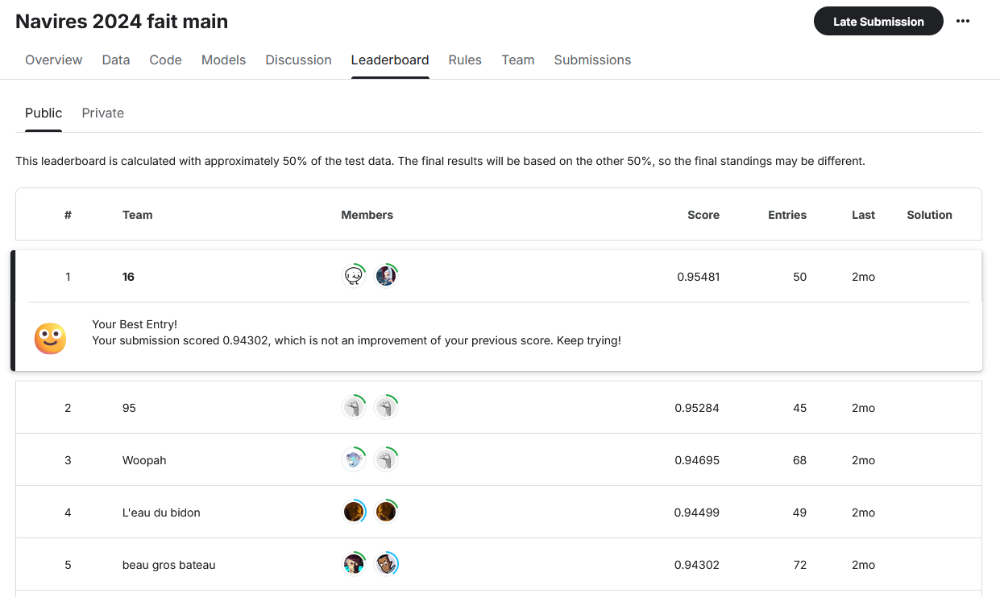
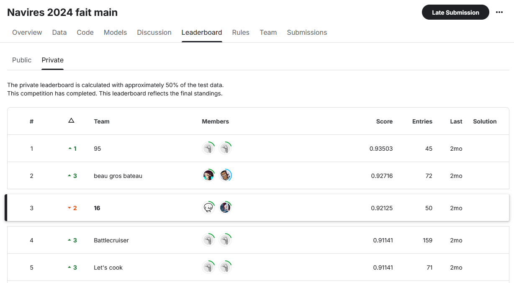

# IREN
Ship Classification - Kaggle Competition

# Authors

Angelo EAP\
Valentin San

# Rules

Ship detection

- Write a CNN by hand in less than 30 layers.
- Submit your results.
- Check your ranking (and start again if necessary).

The leaderboard is calculated with approximately 50% of the test data. 
The final results will be based on the other 50%, so the final standings may be different.

# Result

TOP 1 - Public Score

TOP 3 - Private Score
